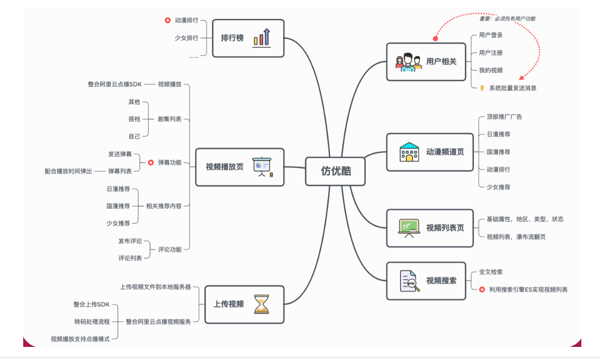
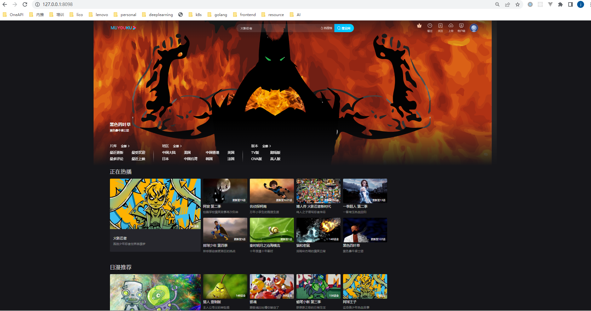

# 以 “优酷网”为蓝本 ，基于PHP构建“慕优酷网”， 后进行Go改造。
fyouku.sql为项目的数据库文件




## 技术栈
```
Go
PHP
MySQL
Redis
RabbitMQ
Elasticsearch
```
## 演示
clone本项目
```
$ git clone fyouku
```
运行前端：
```
$ cd fyouku/
$ bee run
```
运行后端：
```
$ cd fyoukuApi/
$ bee run
```
## 查看效果
访问localhost:8098




## 课程介绍

互联网早期为快速上线，不少网站基于PHP构建，如：阿里的优酷网、Google的YouTube等，但随业务发展，出现性能等问题。当下，5G激发视频行业发展，故本课以 “优酷网”为蓝本 ，先基于PHP构建“慕优酷网”， 后进行Go改造。捞干讲：课程赠送从0到1的PHP源码。核心是：精讲从1到N的Go改造踩坑避坑点，掌握三大性能利器：Redis、RabbitMQ、Elasticsearch，改造完压测对比，看得见的性能提升。还原真实项目架构演进、代码重构迭代过程。源于真实阿里项目，让你的能力接轨于企业刚需，助你实现“人生逆袭”。

## 课程目录

```
第1章 学前准备
本章详情：1【播放】一段别开生面的VCR；2【演示】一个有点炫的本课项目效果Vlog；3【赠送】一本课程配套在线电子书；4【介绍】本课程与谁灵魂契合？为什么要学本课？收获是什么？学习的正确姿势？

 1-1 有点【炫】的项目效果，有点【牛】的技术栈试看
第2章 仿阿里优酷网:Go改造PHP项目踩坑避坑指北-序
本章以架构师的视角对项目进行分析，核心是：为什么要进行改造，即：给出改造的背景和原因，总结线上项目常遇到的问题及给出企业级解决方案。最后介绍为什么选择Go来改造。

 2-1 系统架构演化史
 2-2 线上问题总结，引发的改造思考
 2-3 要达到什么目标
 2-4 为什么选择Go语言改造
第3章 前后端分离：Beego+Go【企业主流架构优选】
Beego：一个融入了 Go的高性能架构思维的框架，一款能帮助小伙伴们轻松构建与开发 Go 项目的开源框架，能快速开发 API、Web 及后端服务等各种应用，是一个 RESTful 的框架。本章带你快速从入门到上手Beego框架，为后续开发“慕优酷网”做准备！ ...

 3-1 beego框架介绍和GO环境搭建
 3-2 beego和bee工具安装以及创建项目
 3-3 beeg路由配置以及MVC开发模式...
 3-4 过滤器和配置信息
 3-5 view语法
 3-6 orm使用
 3-7 数据库CRUD操作（上）
 3-8 数据库CRUD操作（下）
 3-9 数据库原生SQL操作
 3-10 数据库操作
第4章 “慕优酷网”核心改造【Don't speak，show U the code】
本章针对容易出现性能瓶颈的功能进行改造，涵盖"优酷网"原有功能80%，体验一个完整的系统。在Coding之前,讲师提前通过PHP完成改造前代码的实现。采用【对比式讲解】,如：Go VS PHP的编程技巧，最后对两个系统进行性能对比总结改造的效果。...

 4-1 和PHP混个脸熟
 4-2 磨刀不误砍柴工-改造思路
 4-3 改造注册和登录功能（一）
 4-4 改造注册和登录功能（二）
 4-5 改造频道页-顶部广告功能
 4-6 改造频道页-正在热播功能
 4-7 改造频道页-日漫国漫推荐功能试看
 4-8 改造频道页-少女推荐功能
 4-9 改造视频列表页（一）
 4-10 改造视频列表页（二）
第5章 改造视频播放页【此处有“最硬核”的：云点播、弹幕】
本章整合阿里云点播播放器实现视频播放功能。囊括：欧视频剧集和用户相关的评论功能。最后重磅：整套弹幕功能实现教程，一箩筐有点干的硬技能！

 5-1 整合阿里云点播播放器
 5-2 改造视频播放页
 5-3 改造评论功能（上）
 5-4 改造评论功能（中）
 5-5 改造评论功能（下）
 5-6 改造排行榜功能
 5-7 改造批量发送消息功能
 5-8 改造弹幕功能（上）
 5-9 改造弹幕功能（中）
 5-10 改造弹幕功能（下）
第6章 整合阿里云点播，契合企业需求
上传视频分为两个模式，一种，上传视频文件到本地服务器的模式来完成功能。方便学习掌握。另外一种模式，整合阿里云上传视频SDK，使用阿里云服务。增加面试和工作中经验，契合企业真实需求。

 6-1 改造我的视频管理功能
 6-2 改造上传视频功能（一）
 6-3 改造上传视频功能（二）
 6-4 视频上传阿里云 - 开通账号和控制台演示
 6-5 视频上传阿里云 - 整合客户端SDK
 6-6 视频上传阿里云 - 上传、刷新、播放凭证接口
 6-7 视频上传阿里云 - 回调接口
 6-8 视频上传阿里云 - 改造上传视频和播放视频功能
第7章 测试改造效果和线上部署【对比式讲解，看得见的性能提升】
激动人心的一章，花费这么多节课把所有的功能已经用GO改造完成了，下面就要验证改造的效果了。使用专业测试软件jmeter工具对改造功能进行效果测试，数据说明一切。

 7-1 测试改造效果（一）
 7-2 测试改造效果（二）
 7-3 项目线上部署
 7-4 项目演示和总结
第8章 企业真实场景，通过redis改造相关【性能优化三大利器之一】
本章基于redis对核心接口进行了优化，可以学习到如何开发高可用和高性能功能的开发思路。

 8-1 redis介绍和安装
 8-2 redis Demo开发
 8-3 改造思路讲解和视频详情接口改造
 8-4 改造评论列表接口
 8-5 改造视频剧集接口
 8-6 改造排行榜接口和改造功能演示试看
 8-7 本章小结
第9章 业务解耦的关键：MQ消息中间件【性能优化三大利器之一】
介绍目前最主流的消息中间件RabbitMQ，通过对RabbitMQ的基本概念讲解使同学快速入门，并实战讲解RabbitMQ的连接池、生产者、消费者的实现。并对RabbitMQ死信队列进行讲解。最后讲解队列的使用场景和好处。

 9-1 RabbitMQ基础知识讲解
 9-2 RabbitMQ的安装
 9-3 RabbitMQ工作模式 - 发送端和接收端封装
 9-4 RabbitMQ工作模式 - 简单模式和work工作模式
 9-5 RabbitMQ消息持久化和手动应答
 9-6 RabbitMQ工作模式 - 订阅模式
 9-7 RabbitMQ工作模式 - 路由模式
 9-8 RabbitMQ工作模式 - 主题模式
 9-9 RabbitMQ - 死信队列（一）
 9-10 RabbitMQ - 死信队列（二）
 9-11 改造发布评论后更新排行榜功能
 9-12 改造批量发送消息功能
 9-13 改造虚拟增加评论数功能
 9-14 本章小结
第10章 第十章-基于Go本身高性能特性，利用Goroutine改造
Go语言最令人兴奋的一点：Go并发编程。Go原生的支持使得并发实现简单而有趣。本章对Go并发从基本概念到实战应用进行了讲解。

 10-1 goroutine基础和Demo（一）
 10-2 goroutine基础和Demo（二）
 10-3 改造评论列表功能
 10-4 改造批量发送消息功能
 10-5 本章小结
第11章 基于ElasticSearch改造【性能优化三大利器之一】
Elaticsearch是开源的高扩展的搜索引擎，是全文搜索的首选。本章选用ES改造相关功能。契合企业需求，当数据量变大和有全文检索需求时企业必然会选择es来优化和改造。

 11-1 ElasticSearch基本知识和如何分词
 11-2 ElasticSearch、head、Ik的安装
 11-3 ElasticSearch搜索函数封装
 11-4 添加、修改、删除接口封装
 11-5 创建索引和mapping已经增删改的实现
 11-6 搜索功能实现
 11-7 导入所有视频数据到ES脚本
 11-8 改造搜索视频功能
 11-9 改造视频列表功能
 11-10 本章小结
第12章 微服务化实践【紧随技术风向标】 
本章讲解了微服务架构的重要概念，并通过单体框架和微服务架构的对比，分析了要改造的系统，并对系统进行了拆分。最后通过实战讲解了Go的微服务框架go-micro，并对上面实现的两个功能进行微服务化。

 12-1 什么是微服务以及优缺点 
 12-2 micro、go-micro、etcd、protobuf讲解和安装 
 12-3 改造用户登录功能，编写proto文件 
 12-4 改造用户登录功能 - 服务端代码 
 12-5 改造用户登录功能 - 客户端功能 
 12-6 改造用户登录功能 - API接口 
 12-7 改造视频频道页功能 - 编写proto文件 
 12-8 改造视频频道页功能 - 服务端功能 
第13章 时间管理【赠送彩蛋：自律给我自由】 
本章与技术无关，但相信对同学一生有帮助。程序猿的一天：在公司不知不觉忙碌一天,回到家，躺床上玩玩手机，12点睡觉。日子一天天过去，一晃几年，技术达到瓶颈，每年都没什么差别。怎么改变避免这种情况？本章老师给你些建议。 ...

 13-1 目标管理 - 梦想九宫格，掌握人生计划的主动性 
 13-2 目标管理 - 人生的六大高度 
 13-3 要事优先、吃青蛙、四象限、番茄工作法 
 13-4 早起、反思、事件分类 
 13-5 GTD和本章小结 
第14章 最终回-有缘江湖再会 
时间管理中讲过反思的重要性，同样适用于本课程。本章对改造后的架构和旧架构进行了对比和反思。并对课程中涉及到的知识点进行梳理和总结，加强对课程的掌握度。

 14-1 全课总结复盘 
第15章 【赠送超值补课包】极速上手Go语言基础【不含答疑服务】
免费赠送Go基础补课福利~学习本课程针对Go基础不够扎实/想要快速回顾Go语法的小伙伴，特别赠送广受好评的热门实战课：《Google老师带
 15-1 Google资深工程师深度讲解go语言
 15-2 内建变量类型
 15-3 常量与枚举
 15-4 条件语句
 15-5 循环
 15-6 函数
 15-7 指针
 15-8 数组
 15-9 切片的概念
 15-10 切片的操作
 15-11 切片例题_广度优先走迷宫
 15-12 Map
 15-13 Map例题
 15-14 字符和字符串处理
 15-15 结构体和方法
 15-16 包和封装
 15-17 扩展已有类型
 15-18 GOPATH以及目录结构
```

## 博客笔记

https://blog.csdn.net/aa18855953229/category_10607271.html
```
